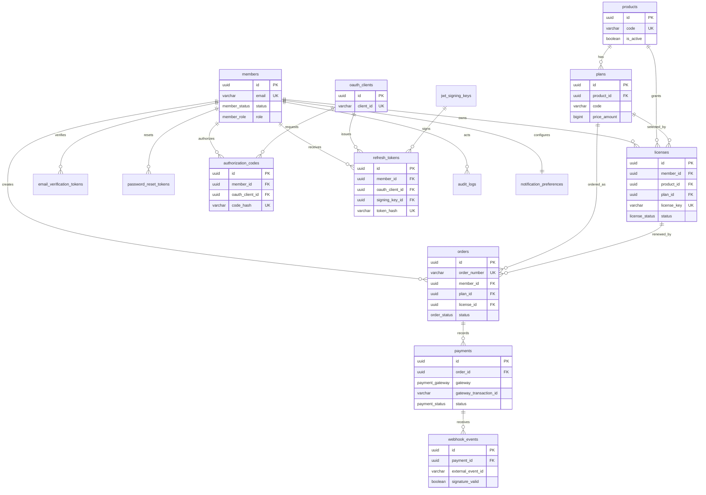

# Entity Relationship Diagram (ERD)

## Tujuan

ERD ini mendefinisikan model data relasional untuk Central Membership & SSO Hub.
Database utama menggunakan PostgreSQL 15+ dengan Prisma sebagai ORM. Primary key
menggunakan UUID, timestamp disimpan sebagai UTC, dan nama tabel/kolom memakai
`snake_case`.

## Relasi dan batasan penting

| Relasi | Kardinalitas | Aturan integritas |
|---|---:|---|
| Member → License | 1 : N | Satu member hanya boleh memiliki satu lisensi yang masih berlaku per produk. |
| Product → Plan | 1 : N | Paket selalu dimiliki tepat oleh satu produk. |
| License → Order | 1 : N | Order dapat membuat lisensi baru atau memperpanjang lisensi yang sudah ada. |
| Order → Payment | 1 : N | Mendukung percobaan ulang; hanya pembayaran sukses yang memfinalkan order. |
| Payment → Webhook Event | 1 : N | Payload/retry gateway dicatat untuk audit dan idempotensi. |
| OAuth Client → Code/Token | 1 : N | Authorization code dan refresh token terikat pada client peminta. |

Aturan satu lisensi aktif per member dan produk diterapkan melalui partial unique
index pada `licenses (member_id, product_id)` untuk status selain `cancelled`.
