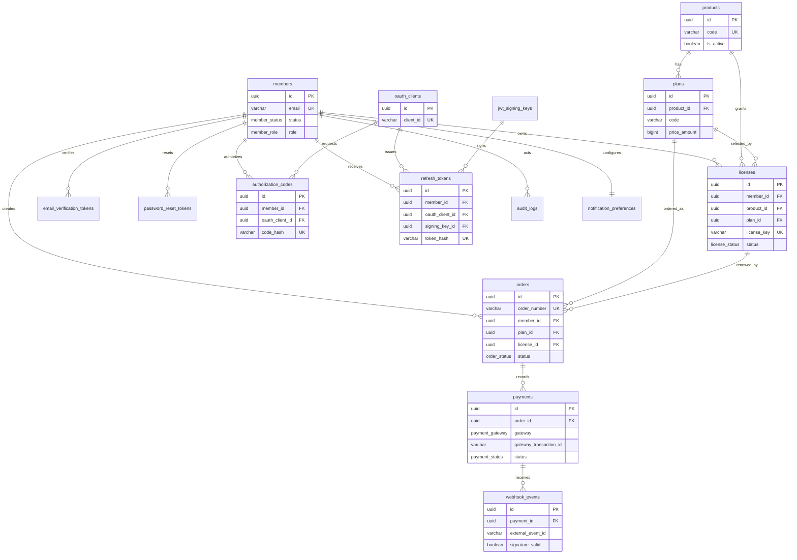

# Entity Relationship Diagram (ERD)

## Purpose

This ERD defines a relational data model for the Central Membership & SSO Hub. The primary database uses PostgreSQL 15+ with Prisma as the ORM. The primary key uses UUID, timestamps are stored as UTC, and table/column names use `snake_case`.

## Important Relationships and Constraints

| Relationship | Cardinality | Integrity Rule |
| --- | ---: | --- |
| Member → License | 1 : N | One member can only have one active license per product. |
| Product → Plan | 1 : N | A plan is always owned by one product. |
| License → Order | 1 : N | An order can create a new license or renew an existing one. |
| Order → Payment | 1 : N | Supports retries; only successful payments finalize an order. |
| Payment → Webhook Event | 1 : N | Payload/retry gateway is recorded for audit and idempotence. |
| OAuth Client → Code/Token | 1 : N | Authorization code and refresh token are tied to the requesting client. |

The rule of one active license per member and product is enforced through a partial unique index on `licenses (member_id, product_id)` for statuses other than `cancelled`.