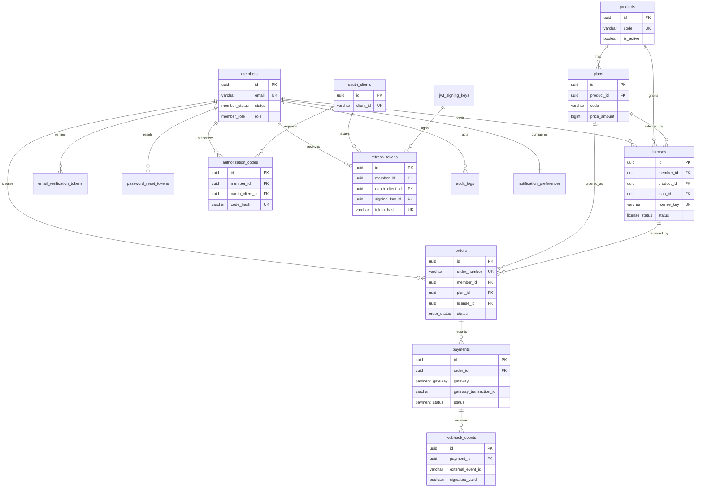

# エンティティ関係図 (ERD)

## 目的

この ERD は、Central Membership & SSO Hub のデータ リレーショナル モデルを定義します。
主なデータベースは PostgreSQL 15+ を使用し、Prisma を ORM として使用します。主キーは UUID を使用し、タイムスタンプは UTC を使用し、テーブル/カラム名は `snake_case` を使用します。

## 関係と重要な制約

| 関係 | カーディナリティ | 正規化規則 |
|---|---:|---|
| Member → License | 1 : N | 1 つのメンバーは 1 つの有効なライセンスを 1 つの製品につき 1 つしか持つことができません。 |
| Product → Plan | 1 : N | パックは 1 つの製品にのみ属します。 |
| License → Order | 1 : N | オーダーは新しいライセンスを作成したり既存のライセンスを更新したりできます。 |
| Order → Payment | 1 : N | 1 つのオーダーは 1 つの有効な支払いを伴うことができます。 |
| Payment → Webhook Event | 1 : N | 支払いのリトライ/ペイロードはオーダーと関連付けられ、IDEMPOTENT になります。 |
| OAuth Client → Code/Token | 1 : N | 認証コードとリフレッシュトークンはクライアントに紐付けられます。 |

1 つのライセンスが 1 つのメンバーと 1 つの製品につき 1 つしか有効であることを保証するために、`licenses (member_id, product_id)` に partial unique index を使用します。